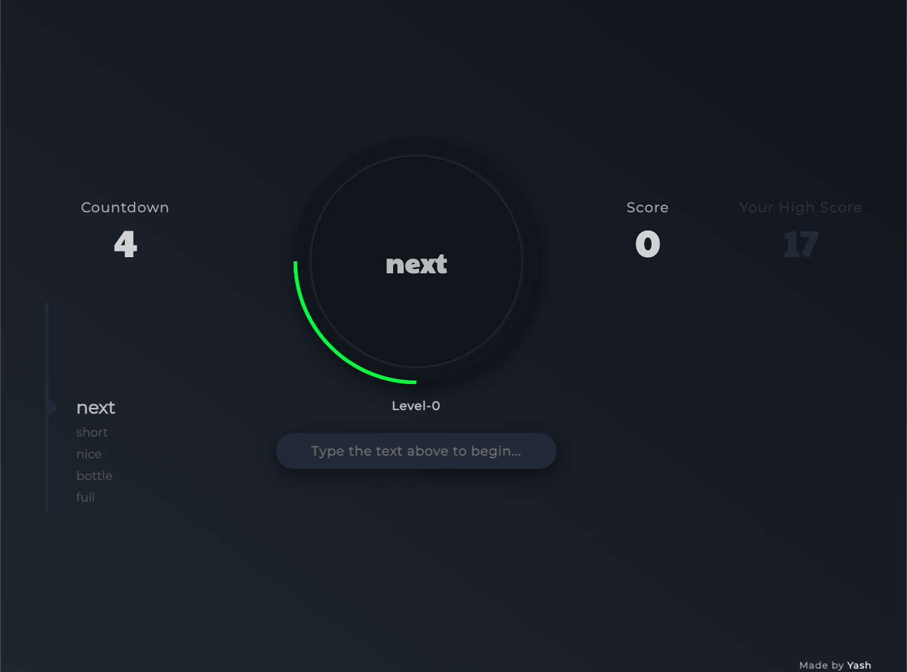

# Word Beater Game

## Overview

The **Word Beater Game** is an interactive and fun typing game that challenges users to type words quickly as they scroll across the screen. The game includes a countdown timer and a real-time scoring system that tracks words per minute (WPM). The goal is to improve typing speed and accuracy while having fun.

This project is built using **Vanilla JavaScript**, HTML, and CSS, and it is mobile-responsive, providing a smooth experience on both desktop and mobile devices.

## Features

- **Word Scrolling**: Words scroll across the screen, and the user must type them before they disappear.
- **Countdown Timer**: A countdown timer runs as the user types, adding a sense of urgency.
- **Score Tracking**: Displays the current score and tracks your words per minute (WPM).
- **High Score**: Keeps track of the highest score across sessions.
- **Mobile Responsiveness**: Works seamlessly on both desktop and mobile devices.

## Project Steps

1. **Design and Layout**: Designed the layout using HTML and CSS to create a clean, responsive, and interactive UI.
2. **Game Logic**: Developed the game mechanics using JavaScript, including the timer, word generation, and user input handling.
3. **Graphical Representation**: Added a real-time graph to track and display words per minute (WPM) using Chart.js.
4. **Mobile Compatibility**: Ensured the game is fully responsive for a smooth experience on mobile devices.

## Challenges

- Managing the smooth scrolling of words and ensuring that the game mechanics worked seamlessly without using any external libraries (besides Chart.js).
- Handling real-time user input and game progression with minimal delays to ensure the game remains fast-paced and enjoyable.

## Demo

- You can play the **Word Beater Game** directly by visiting the live demo at: [Play Word Beater Game](https://your-website-link.com/word-beater)

## GitHub Repository

You can find the source code for this project in my GitHub repository:

- [Word Beater Game GitHub Repository](https://github.com/YOUR_GITHUB_USERNAME/word-beater)

## Technologies Used

- **Vanilla JavaScript**: For game mechanics, DOM manipulation, and event handling.
- **HTML5 & CSS3**: For structuring and styling the game interface.
- **Chart.js**: For visualizing words per minute (WPM) using a real-time graph.
- **Font Awesome**: For adding icons and enhancing the UI.

## Conclusion

The Word Beater Game is a fun and interactive way to practice typing speed and accuracy. This project showcases my ability to create dynamic web applications using just **Vanilla JavaScript**, without relying on frameworks. Despite its simplicity, the game provides an enjoyable and challenging experience for users.

## License

MIT License (Replace with your actual license, if applicable)

